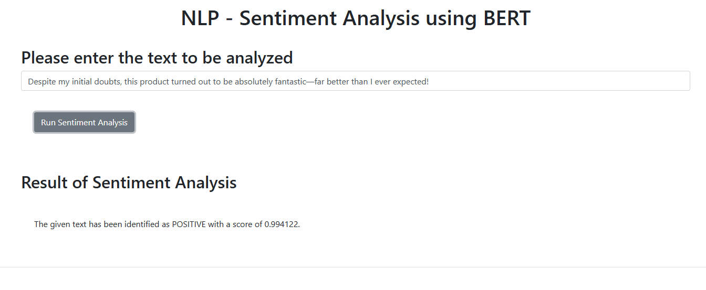

# BERT Sentiment Analysis API

A Flask-based web application that provides sentiment analysis using BERT models from Hugging Face.

## Overview

This application uses a pre-trained BERT model to analyze the sentiment of text. It provides a web interface where users can input text, and the application will return a sentiment analysis with a label (positive, negative, or neutral) and a confidence score.

## Features

- RESTful API for sentiment analysis
- Uses DistilBERT, a lighter and faster version of BERT, fine-tuned for sentiment analysis
- Web interface for easy interaction
- Fast inference with PyTorch
- Response format compatible with IBM Watson NLP API

## Requirements

- Python 3.8+
- PyTorch
- Transformers (Hugging Face)
- Flask
- Internet connection (for initial model download)

## Installation

1. Clone the repository:
   ```bash
   git clone https://github.com/yourusername/bert-sentiment-api.git
   cd bert-sentiment-api
   ```

2. Install the required packages:
   ```bash
   pip install -r requirements.txt
   ```

3. Create a `requirements.txt` file with the following dependencies:
   ```
   flask==2.0.1
   torch==1.9.0
   transformers==4.9.2
   ```

## Project Structure

```
bert-sentiment-api/
├── app.py                  # Main Flask application
├── sentiment_analysis.py   # BERT sentiment analyzer module
├── templates/              # HTML templates
│   └── index.html          # Web interface
├── static/                 # Static assets (CSS, JS)
└── README.md               # This documentation
```

## Usage

### Starting the Server

Run the Flask application:

```bash
python app.py
```

The server will start on port 5003. You can access the web interface at:
```
http://localhost:5003/
```

### API Endpoint

The sentiment analysis API is available at:
```
http://localhost:5003/sentimentAnalyzer?textToAnalyze=your text here
```

#### Example Request:
```
GET /sentimentAnalyzer?textToAnalyze=I love this product!
```

#### Example Response:
```json
{
  "message": "The given text has been identified as positive with a score of 0.9984."
}
```

### Programmatic Usage

You can also use the sentiment analyzer in your Python code:

```python
from sentiment_analysis import sentiment_analyzer

# Analyze sentiment
result = sentiment_analyzer("I love this product!")
print(result)
# Output: {'documentSentiment': {'label': 'positive', 'score': 0.9984}}
```

## How It Works

1. The `BertSentimentAnalyzer` class loads a pre-trained DistilBERT model fine-tuned for sentiment analysis.
2. Text is tokenized and processed through the model.
3. The model outputs prediction scores for each sentiment class.
4. The highest-scoring sentiment is selected as the predicted sentiment.
5. The Flask application wraps this functionality in a web interface and REST API.

## Customization

### Using a Different Model

You can modify the `model_name` parameter in the `BertSentimentAnalyzer` class to use a different pre-trained model from Hugging Face:

```python
analyzer = BertSentimentAnalyzer(model_name="nlptown/bert-base-multilingual-uncased-sentiment")
```

Some recommended models:
- `distilbert-base-uncased-finetuned-sst-2-english` (default)
- `nlptown/bert-base-multilingual-uncased-sentiment` (multilingual)
- `finiteautomata/bertweet-base-sentiment-analysis` (optimized for Twitter)

## Limitations

- The model has a maximum input length of 512 tokens
- Performance may vary depending on text domain and language
- Initial loading of the model may take time depending on internet speed

## License

[MIT License](LICENSE)

## Contributing

Contributions are welcome! Please feel free to submit a Pull Request.

## Acknowledgements

- This project uses models from [Hugging Face Transformers](https://huggingface.co/transformers/)
- The sentiment analysis model is based on [DistilBERT](https://huggingface.co/distilbert-base-uncased-finetuned-sst-2-english)
